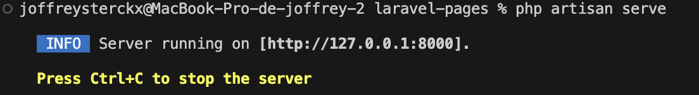
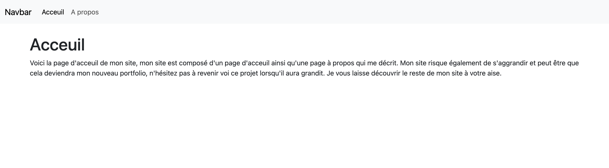
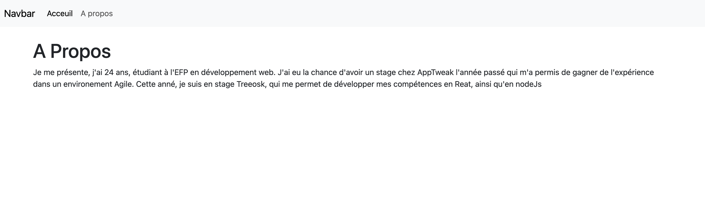
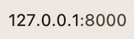
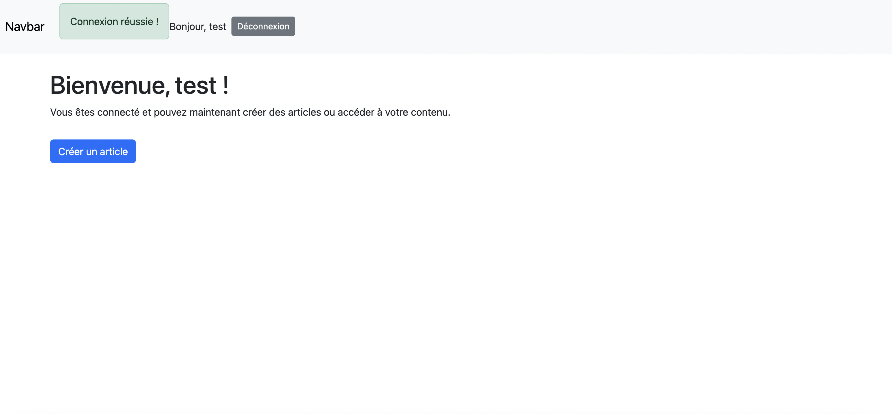
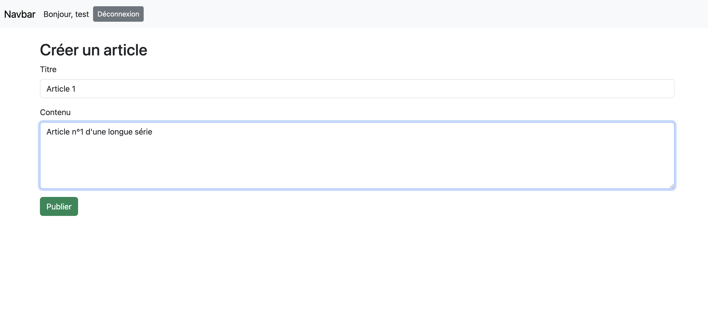
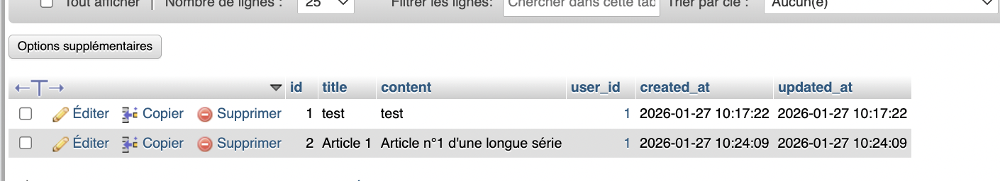

## Laravel Pages

# Description du projet

Laravel Pages est un petit projet Laravel qui permet de créer un site simple avec deux pages :  
- Accueil  
- À propos 

Le projet utilise :  
- Laravel (PHP framework)  
- Blade (moteur de templates)  
- Bootstrap pour le style et la mise en page  

# Prérequis

Avant d’installer le projet, vous devez avoir installer :  

- PHP
- Composer 
- Git 
 
# Cloner le projet

1. Ouvrir un terminal et cloner le dépôt :  

git clone https://github.com/SterckxJoffrey/laravel-pages.git

2. Installer les dépendance de composer 

composer install

3. Copier le .env.example dans votre dossier.

4. Générer la clé de l'application

php artisan key:generate

5. Lancer le server de développement

php artisan serve

# Url des pages créés 

- L'URL de la page d'accueil est : "/"  
- L'URL de la page d'à-propos est : "/a-propos  "  

# Dcocumentation

